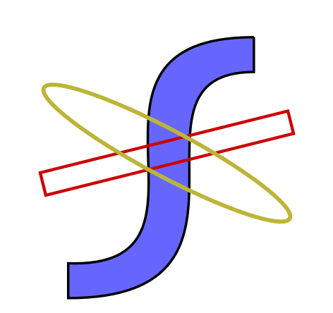
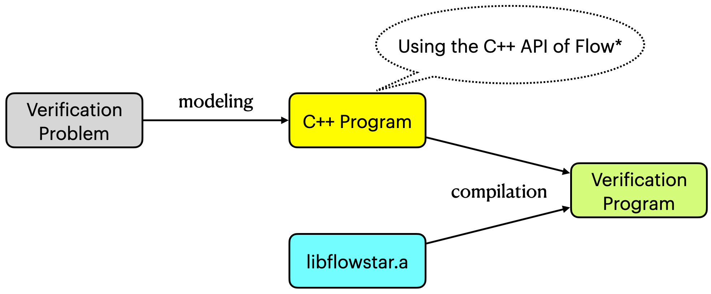
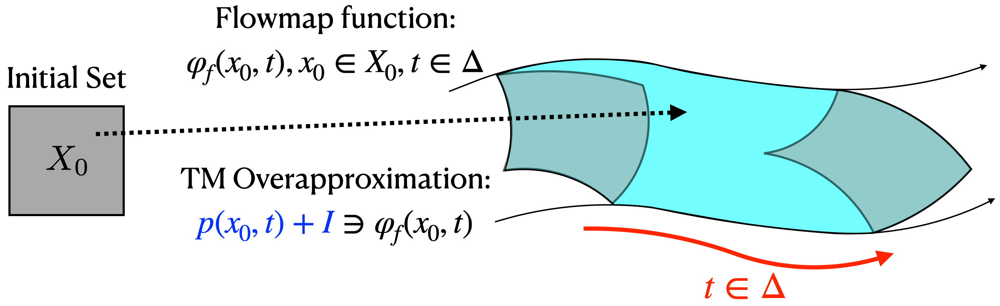
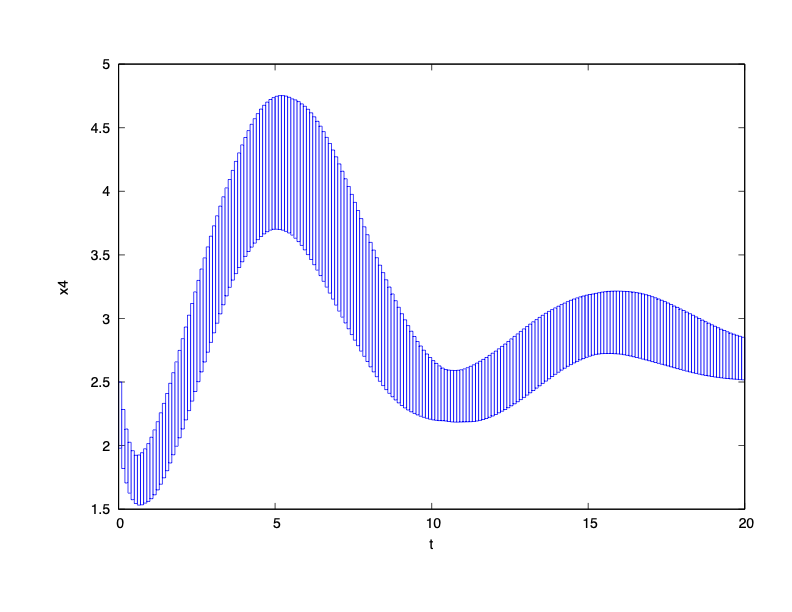
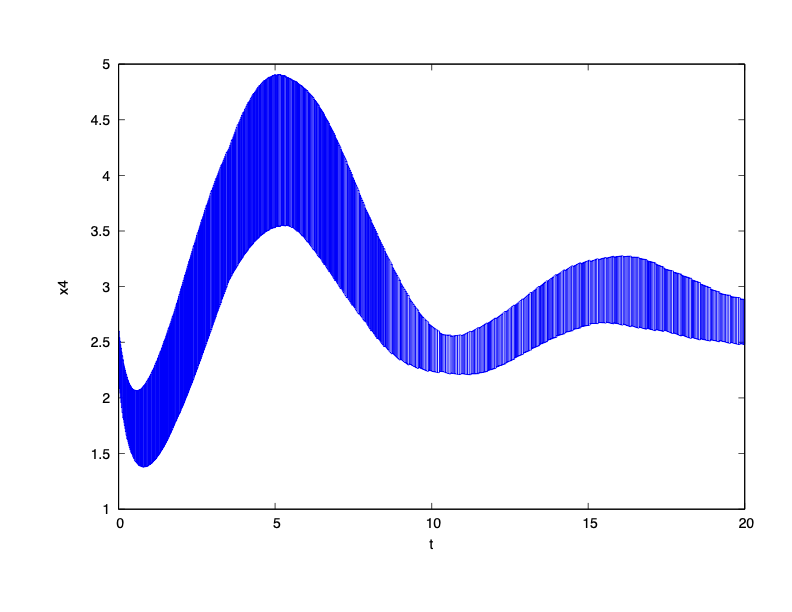
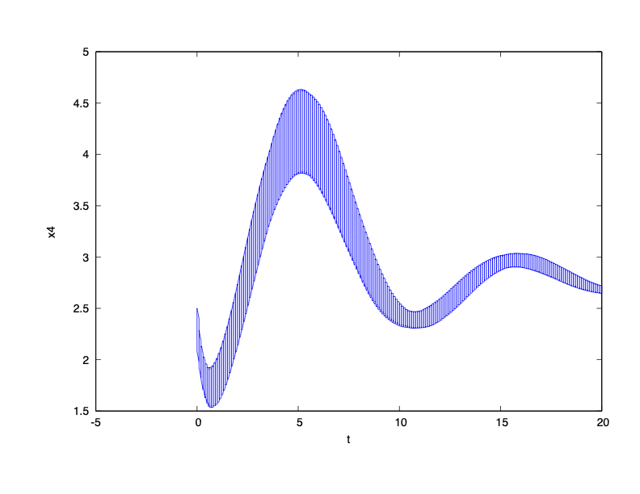
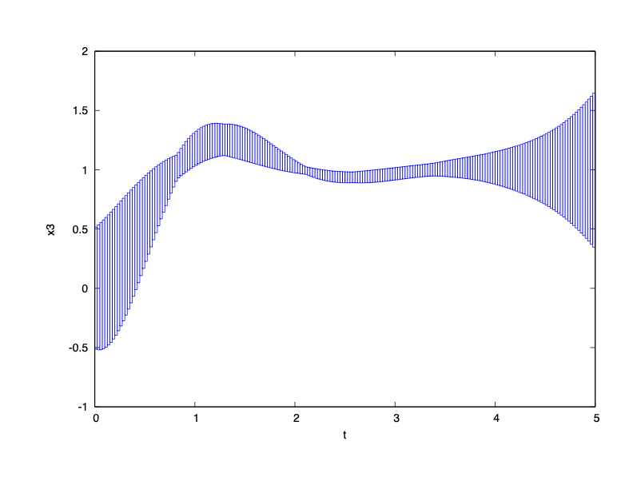
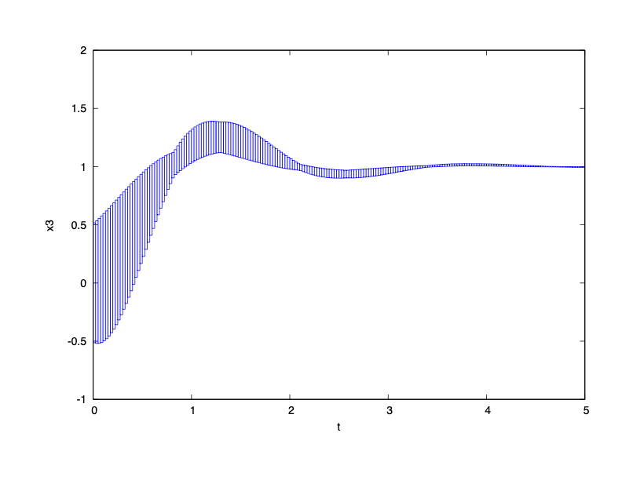

##  Flow* Toolbox -   *A Platform for Modeling and Analysis of Cyber-Physical Systems*

# Introduction

This is the homepage of the toolbox version of Flow\*. The first version of Flow\* was released in the year of 2013, and improved in 2015 (version 1.2.0) and 2017 (version 2.1.0). The purpose of releasing a toolbox version is to provide a more flexible way to model and analyze cyber-physical systems (CPS), and expose the key functions to the tools for verifying more complex systems, such as the CPS with machine learning components. The main data structures in the toolbox version are completely re-designed and implemented such that the performance is **at least 10x faster** than the version 2.1.0 on hybrid case studies.

**Flow\* is mainly used to compute reachable set overapproximations which are guranteed to contain all approximation and numerical errors.** The following video shows an example of using Flow\* on a mobile device to online detect the future unsafety for the RC car. 
 

 

**Flow\* is also used to verify dynamical systems controlled by neural networks. Please check our tool [POLAR](https://github.com/ChaoHuang2018/POLAR_Tool).**

 

### How does the toolbox work?

The Flow\* toolbox does not have a specific interface, it is compiled as a static library. A verification or reachability task should be described as a C++ file which can be compiled with the Flow\* libarary.

### Main Functionalities

**Time-bounded reachability computation.** Flow* computes Taylor Model (TM) flowpipes for a discrete, continuous or hybrid dynamics over a bounded time interval. TMs are *function* rather than pure range overapproximations. As it is illustrated by the following figure, a TM overapproximates the flowmap of a deterministic dynamics, and its range forms an overapproximation of the reachable set.

**Safety verification.** Conservatively checking the intersection of the TM flowpipe ranges with a given safe or unsafe set.

**Configuration independent relational abstraction for linear dynamics.** The Flow\* toolbox does not directly compute reachable set overapproximations for Linear Time-Invariant (LTI) or Linear Time-Varying (LTV) ODEs. Instead, it generates TM overapproximations for the flowmap functions that maps any initial state to its reachable state at a time. Such abstractions may be reused in verification tasks for different system settings.

The tool can also be used to find potential counterexamples when the overapproximated flowmap is deterministic. E.g., when an unsafe intersection is detected for a TM $p(x_0,t)$, you may use the domain contraction function to reduce $x_0$'s range, which is the initial set, and find an overapproximation of the unsafe initial states.

# Getting Started

### *Installation*

The following GNU open-source libraries should be pre-installed: M4, GMP, MPFR, GSL, GLPK, BISON, FLEX. Most of them are available at [https://ftp.gnu.org/](https://ftp.gnu.org/).

Flow\* does not require an installation. You may simply run **make** to compile the source code and a static library file libflowstar.a will be generated. The compilation should be done by GCC 8.0 or a later version. You may need to rename 'g++' in the makefile to ensure that an appropriate compiler is called.

### *Simple Example*

We present a very simple nonlinear ODE which only has a single state variable:

$$\dot{x} = 1 - \sin(x) \ \frac{\sqrt{\log(x)}}{\exp(\cos(x))}$$

We want to compute its reachable set from the initial state set $x(0)\in {[4.8,5.2]}$.

The above reachability problem can be described by the following C++ program using the Flow\* library.

[Simple Example](benchmarks/continuous/simple/)

### *Main Hyperparameters*

- **_Stepsize._** The time interval for a single TM flowpipe. A smaller stepsize produces TM flowpipes with smaller remainders.

 

- **_TM order._** The degree bound for TM flowpipes. A higher TM order in one time step produces a TM flowpipe with a smaller remainder.

 

- **_Cutoff threshold._** A small value for moving the small terms in the polynomial part of a TM to its remainder. Higher cutoff threshold may greatly simplify a TM but lead to a heavier error accumulation. We give the following comparison to show its impact on the time cost and overapproximation quality (tested on M1 Mac mini).

<table>
  <tr>
    <td>  </td>
    <td>  </td>
    <td>  </td>
  </tr> 
  <tr>
    <td> Cutoff threshold: 1e-5   Time cost: 4.6 seconds </td>
    <td> Cutoff threshold: 1e-6   Time cost: 5.6 seconds </td>
    <td> Cutoff threshold: 1e-7   Time cost: 7.3 seconds </td>
  </tr>
</table>

[Laub-Loomis Model (radius 0.1)](benchmarks/continuous/laubloomis/)

 

- **_Symbolic remainder._** An integer to indicate the complexity of the symbolic remainders. Symbolic remainders are introduced to avoid the wrapping effect from all linear transformations on TM remainders. Using symbolic remainders can greatly reduce the accumulation of errors. We give the following example to show the effectiveness.

<table>
  <tr>
    <td>  </td>
    <td>  </td>
  </tr> 
  <tr>
    <td> Symbolic remainder size: 0   Time cost: 5.3 seconds (M1 Mac mini) </td>
    <td> Symbolic remainder size: 20   Time cost: 3.9 seconds (M1 Mac mini) </td>
  </tr>
</table>

[Quadrotor Model](benchmarks/continuous/quadrotor/)

 

 
 

--
**More content will be added.**

 
 

# References

[1] Xin Chen, Erika Abraham, Sriram Sankaranarayanan.
*Taylor Model Flowpipe Construction for Non-linear Hybrid Systems.*
In Real Time Systems Symposium (RTSS), pp. 183-192, 2012. ([link](https://ieeexplore.ieee.org/document/6424802))

[2] Xin Chen, Erika Abraham, Sriram Sankaranarayanan.
*Flow*: An Analyzer for Non-Linear Hybrid Systems.*
In Computer-Aided Verification (CAV), volume 8044 of LNCS, pp. 258-263, 2013. ([link](https://link.springer.com/chapter/10.1007/978-3-642-39799-8_18))

[3] Xin Chen. *Reachability Analysis of Non-Linear Hybrid Systems Using Taylor Models.* Ph.D. Thesis, RWTH Aachen University, 2015. ([link](https://shinchern.github.io/papers/PhD_Thesis.pdf))

[4] Xin Chen, Sriram Sankaranarayanan.
*Decomposed Reachability Analysis for Nonlinear Systems.*
In Real-Time Systems Symposium (RTSS), 2016. ([link](https://ieeexplore.ieee.org/document/7809839))

[5] Xin Chen, Sergio Mover, and Sriram Sankaranarayanan.
*Compositional Relational Abstraction for Nonlinear Hybrid Systems.*
In ACM Transactions on Embedded Computing Systems (TECS) 16(5): pp. 187:1-187:19, 2017. ([link](https://dl.acm.org/doi/10.1145/3126522))
