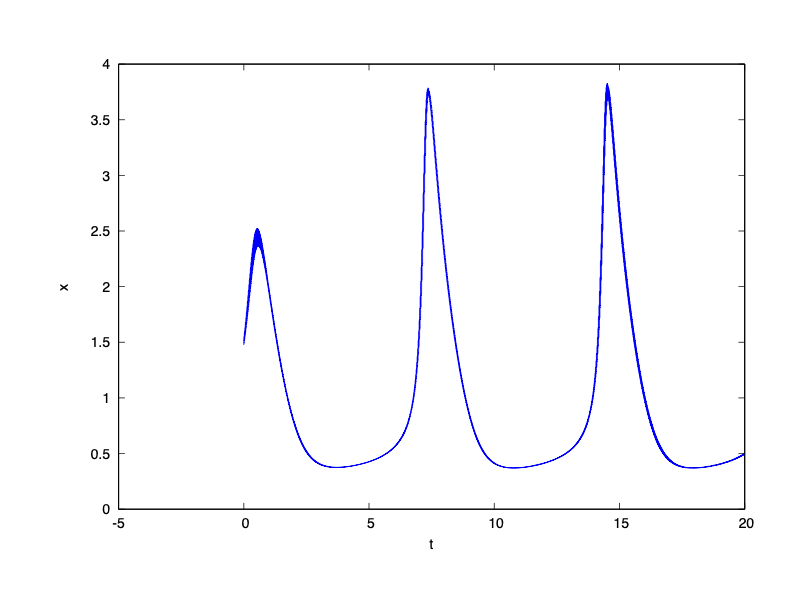
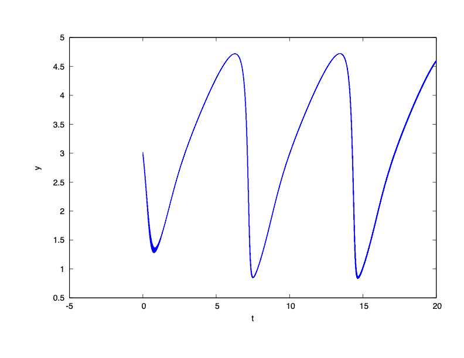

### System Dynamics

$\dot{x} = 1 + x(xy - 4)$

$\dot{y} = x (3 - x y)$

The system has a limited cycle.

### Reachability Problem

Initial state set: $x(0) \in [1.48, 1.52]$, $y(0) \in [2.98, 3.02]$

Time horizon: $[0,20]$

### Result

