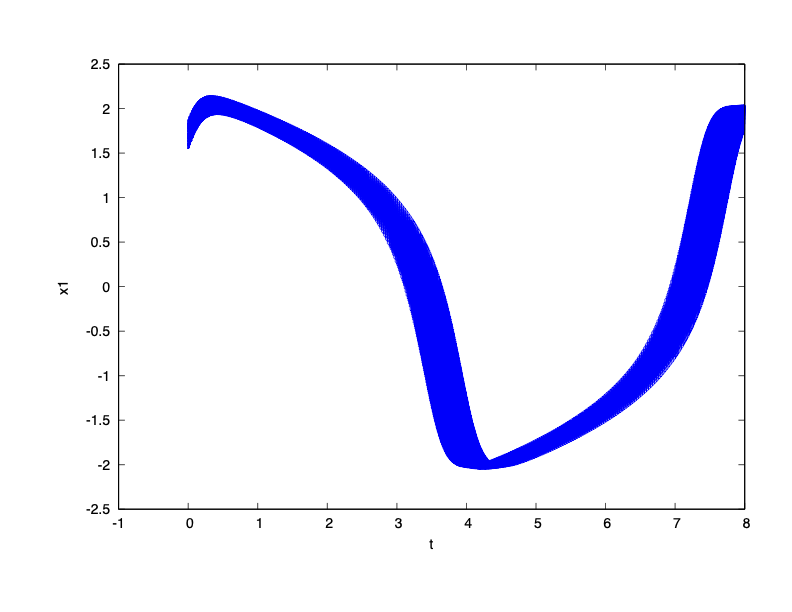
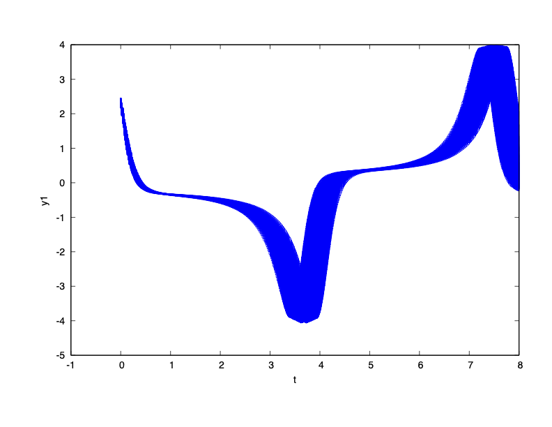

### System Dynamics

$\dot{x}_1 = y_1$

$\dot{y}_1 = 2 (1 - x_1^2) y_1 - 2 x_1 + x_2$

$\dot{x}_2 = y_2$

$\dot{y}_4 = 2 (1 - x_2^2) y_2 - 2 x_2 + x_1$

### Reachability Problem

Initial state set: $x_1(0),x_2(0) \in {[1.55,1.85]}$, $y_1(0),y_2(0) \in {[2.35,2.45]}$

Time horizon: $[0,8]$

Safe Set: $y_1,y_2\leq 4$

### Remark

This is a difficult reachability problem especially for the techniques ensuring numerical conservativeness. Flow\* subdivides the initial set in the dimesnion $x_1$ and $x_2$ independently to $15$ pieces. We find that additionally cutting off even a small error of the size 1e-9 to the flowpipe remainder may make the safety property not verified.

### Result

Octagon overapproximations of the TM flowpipes are in red, 500 simulations computed by Matlab ode45 are in blue.

