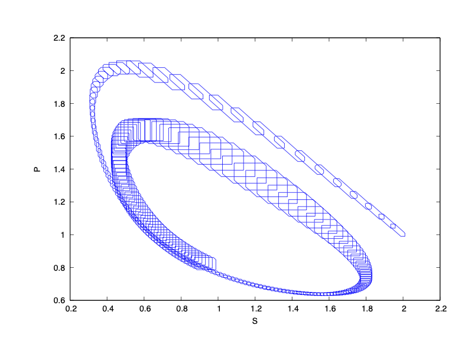

### System Dynamics

$\dot{S} = 1 - [0.9995,1.0005]\ S\ P^2$

$\dot{P} = [0.9995,1.0005]\ S\ P^2 - [0.99951, 1.00051]\ P$

### Reachability Problem

Initial state set: $S(0) \in [1.99,2.01]$, $P(0) \in [0.99,1.01]$

Time horizon: $[0,10]$

### Result

