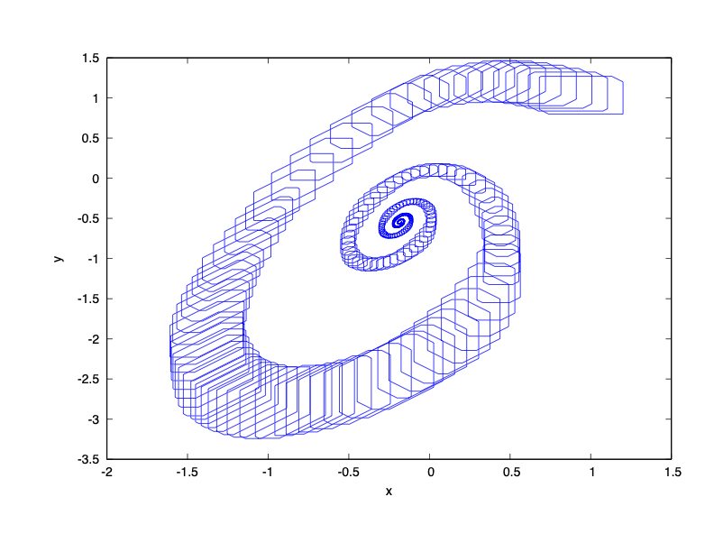

### System Dynamics

$\dot{x} = -0.5 - y - x^2 (1.5 + 0.5x)$

$\dot{y} = 3x - y$

The system has a limited cycle.

### Reachability Problem

Initial state set: $x(0) \in [0.8, 1.2]$, $y(0) \in [0.8, 1.2]$

Time horizon: $[0,20]$

### Result

