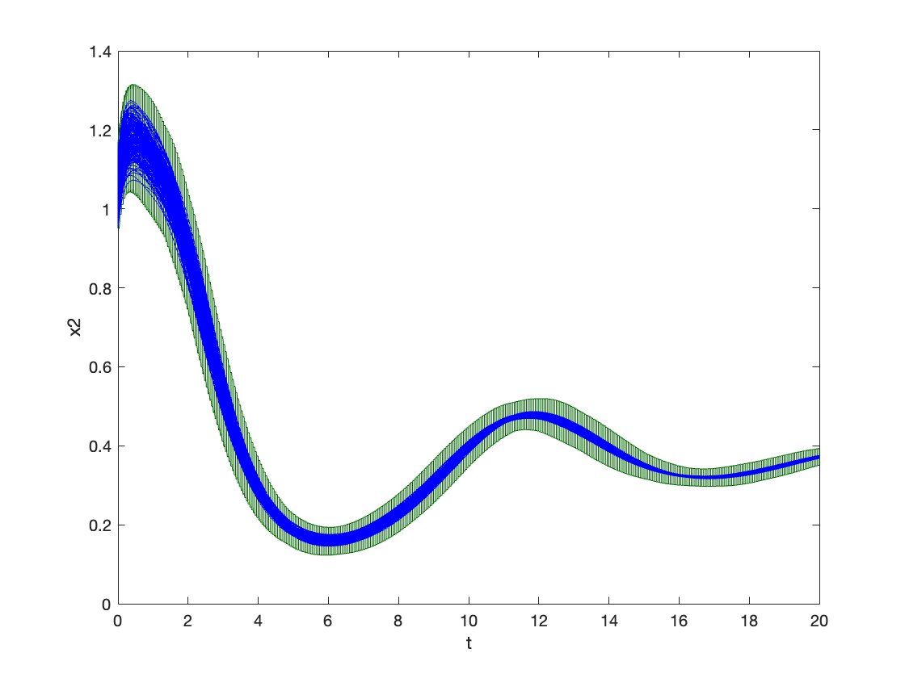
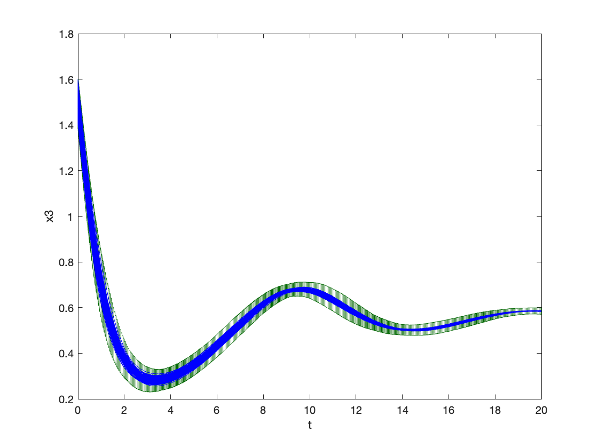
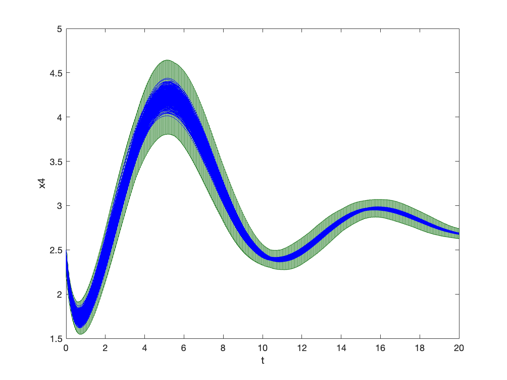
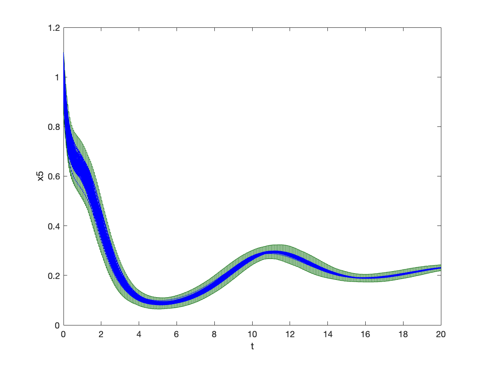
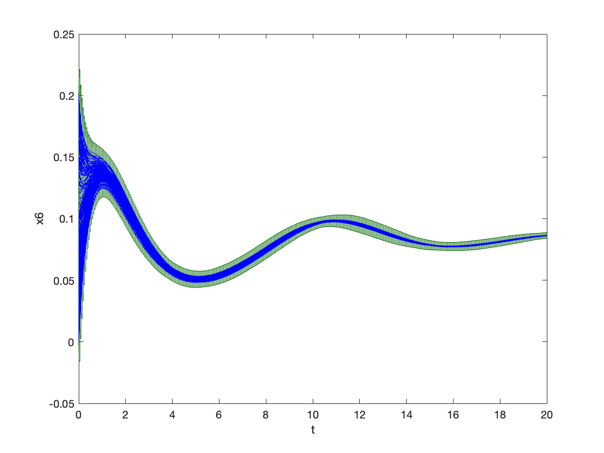
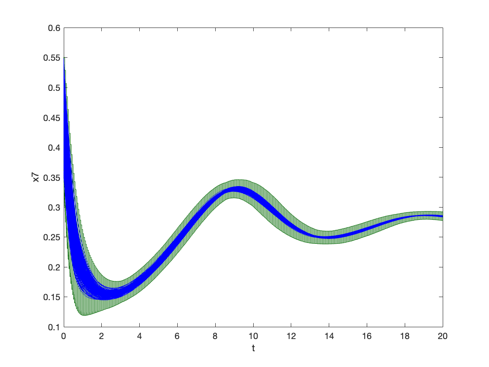

### System Dynamics

$\dot{x}_1 = 1.4 x_3 - 0.9 x_1$

$\dot{x}_2 = 2.5 x_5 - 1.5 x_2$

$\dot{x}_3 = 0.6 x_7 - 0.8 x_3 x_2$

$\dot{x}_4 = 2 - 1.3 x_4 x_3$

$\dot{x}_5 = 0.7 x_1 - x_4 x_5$

$\dot{x}_6 = 0.3 x_1 - 3.1 x_6$

$\dot{x}_7 = 1.8 x_6 - 1.5 x_7 x_2$

### Reachability Problem

Initial state set: The box centered at the following point of radius 0.2. 

$x_1(0) = 1.2$, $x_2(0) = 1.05$, $x_3(0) = 1.5$, $x_4(0) = 2.4$, $x_5(0) = 1$, $x_6(0) = 0.1$, $x_7(0) = 0.45$

Time horizon: $[0,20]$

### Result

