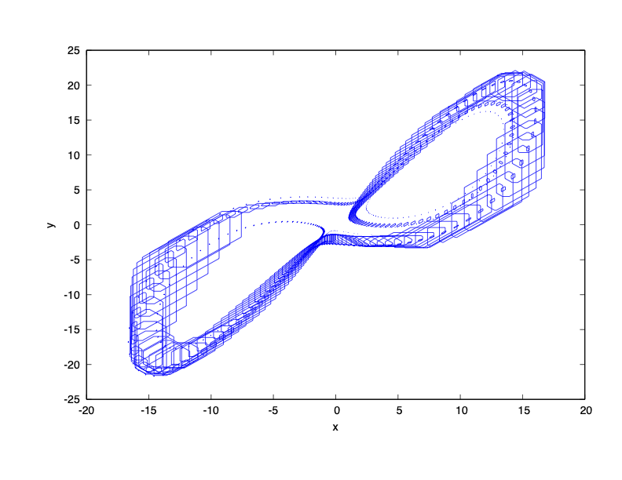
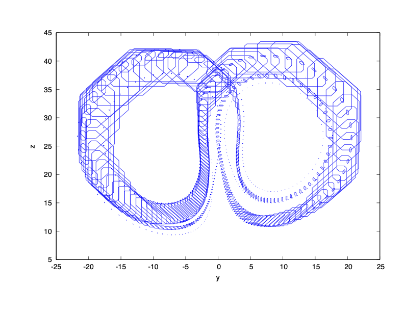

### System Dynamics

$\dot{x} = 10(y - x)$

$\dot{y} = x(28 - z) - y$

$\dot{z} = x y - 2.67 z$

### Reachability Problem

Initial state set: $x(0) \in [14.999, 15.001]$, $y(0) \in [14.999, 15.001]$, $z(0) \in [35.999, 36.001]$

Time horizon: $[0,7]$

### Result

To see how Flow* controls the growth of overestimation, we only plot the reachable set overapproximations at discrete times.

