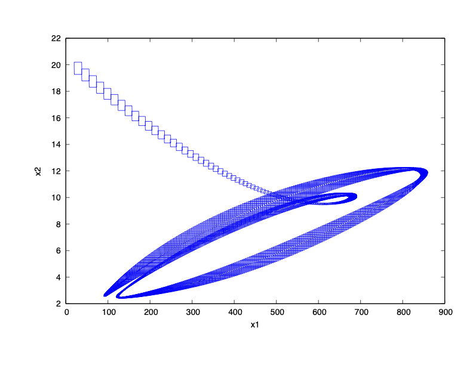
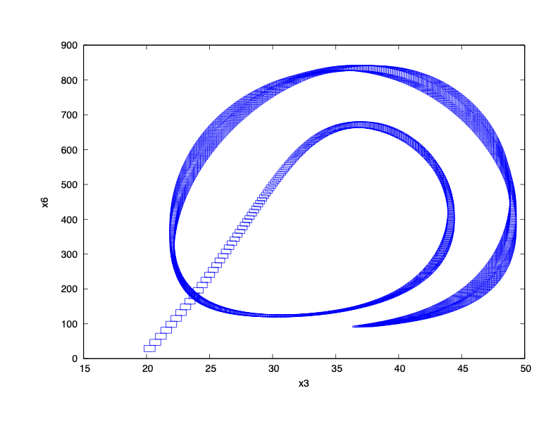

### System Dynamics

$\dot{x}_1 = 1800 - 0.0359 x_1 x_5 - 0.0693 x_1$

$\dot{x}_2 = 5.4 + 54(x_1^2/(547600 + x_1^2)) - 2.88 x+2$

$\dot{x}_3 = 2.88 x_2 - 0.5198 x_3$

$\dot{x}_4 = 59.76 x_3 - 3.24 x_4$

$\dot{x}_5 = 3.24 x_4 - 5.976e-4 x_4^2 - 0.0359 x_5 x_6$

$\dot{x}_6 = 1800 - 0.1155 x_6 - 0.0359 x_5 x_6$

### Reachability Problem

Initial state set: $x_1(0), x_2(0), x_3(0), x_4(0), x_5(0), x_6(0) \in [19.8,20.2]$

Time horizon: $[0,10]$

### Result

