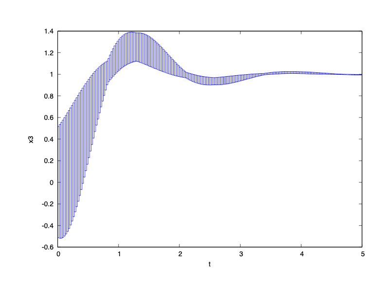

### System Dynamics

$\dot{x}_1 = \cos(x_8) \cos(x_9) x_4 + (\sin(x_7) \sin(x_8) \cos(x_9) - \cos(x_7) \sin(x_9)) x_5 + (\cos(x_7) \sin(x_8) \cos(x_9) + \sin(x_7) \sin(x_9)) x_6$

$\dot{x}_2 = \cos(x_8) \sin(x_9) x_4 + (\sin(x_7) \sin(x_8) \sin(x_9) + \cos(x_7) \cos(x_9)) x_5 + (\cos(x_7) \sin(x_8) \sin(x_9) + \sin(x_7) \cos(x_9)) x_6$

$\dot{x}_3 = \sin(x_8) x_4 - \sin(x_7) \cos(x_8) x_5 - \cos(x_7) \cos(x_8) x_6$

$\dot{x}_4 = x\_{12} x_5 - x\_{11} x_6 - 9.81 \sin(x_8)$

$\dot{x}_5 = x\_{10} x_6 - x\_{12} x_4 + 9.81 \cos(x_8) \sin(x_7)$

$\dot{x}_6 = x\_{11} x_4 - x\_{10} x_5 + 9.81 \cos(x_8) \cos(x_7) - 9.81 + 7.14285714285714 (x_3 - 1) - 2.14285714285714 x_6$

$\dot{x}_7 = x\_{10} + \sin(x_7) \tan(x_8) x\_{11} + \cos(x7)\tan(x_8) x\_{12}$

$\dot{x}_8 = \cos(x_7) x\_{11} - \sin(x_7) x\_{12}$

$\dot{x}_9 = \tan(x_0)x\_{11} + (\cos(x_7)/\cos(x_8)) x\_{12}$

$\dot{x}_{10} = -0.92592592592593 x\_{11} x\_{12} - 18.51851851851852 (x_7 + x\_{10})$

$\dot{x}_{11} = 0.92592592592593 x\_{10} x\_{12} - 18.51851851851852 (x_8 + x\_{11})$

$\dot{x}_{12} = 0$

### Reachability Problem

Initial state set: $x_1 \sim x_6 \in {[-0.5,0.5]}$ and all other state variables are $0$.

Time horizon: $[0,5]$

Safe Set: $x_3\leq 1.4$

### Result

