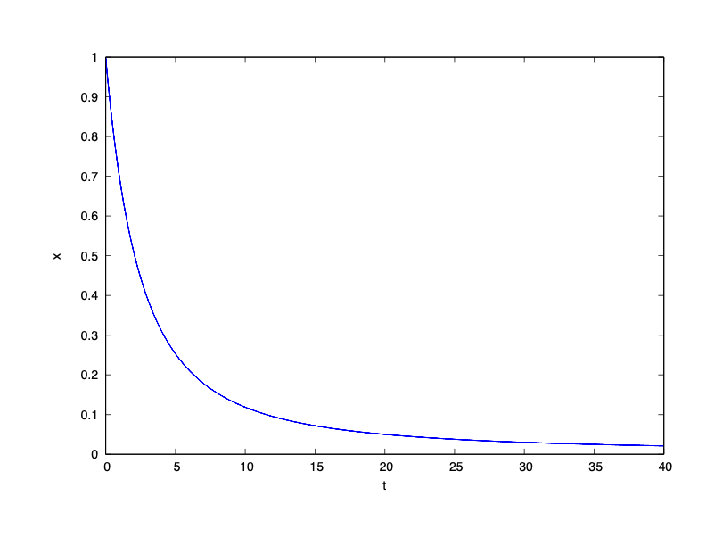
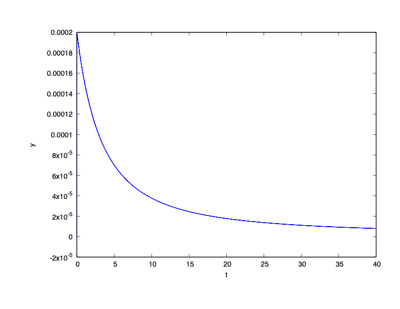
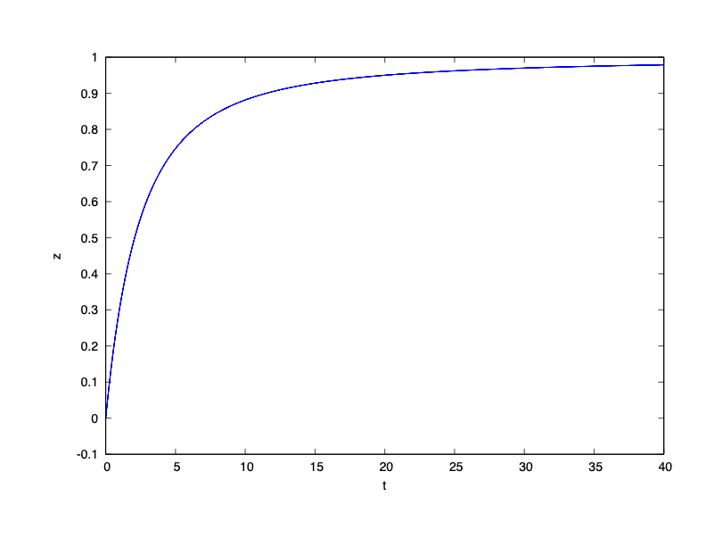
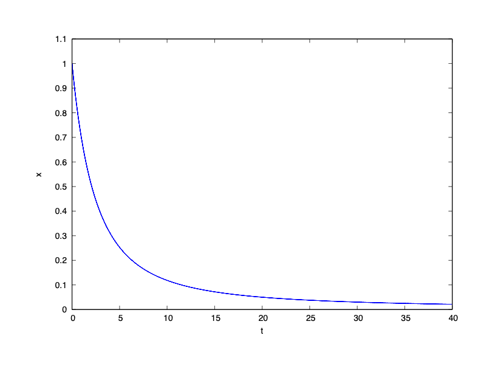
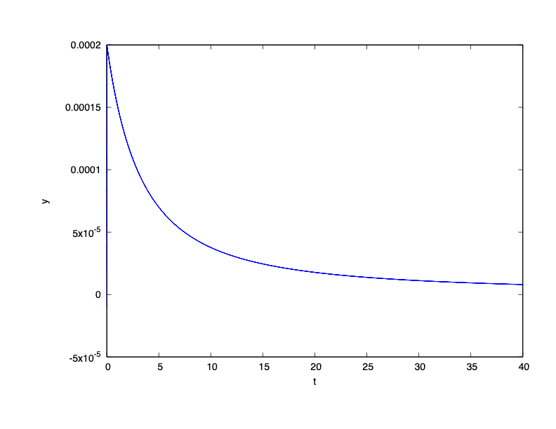

### System Dynamics

$\dot{x} = -0.4 x + 1000 y z$

$\dot{y} = 0.4 x - 1000 y z - 10^7 y^2$

$\dot{z} = 10^7 y^2$

### Reachability Problem 1

Initial state set: $x(0) = 1$, $y(0) =0$, $z(0) = 0$

Time horizon: $[0,40]$

### Result

### Reachability Problem 2

Initial state set: $x(0) \in [0.99999,1.00001]$, $y(0) \in [-0.00001,0.00001]$, $z(0) \in [-0.00001,0.00001]$

Time horizon: $[0,40]$

### Result

