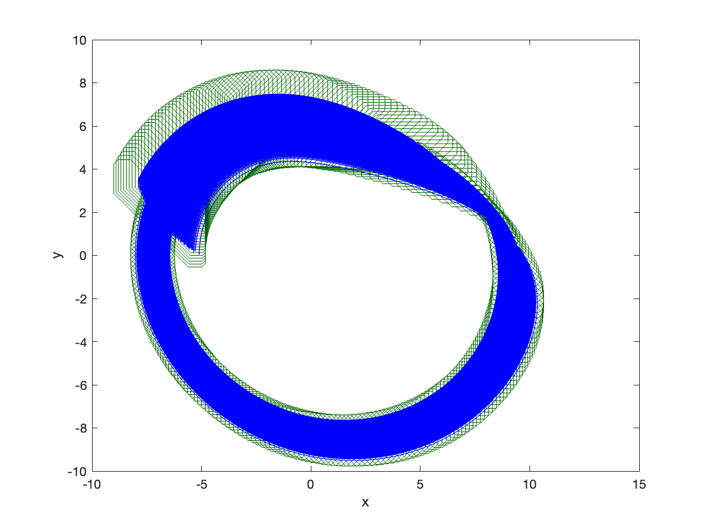
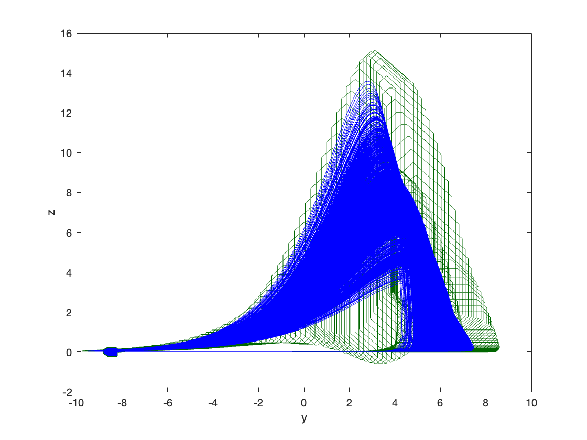

### System Dynamics

$\dot{x} = -y - z$

$\dot{y} = x + 0.2 y$

$\dot{z} = 0.2 + z*(x - 5.7)$

### Reachability Problem

Initial state set: $x(0) \in [-0.2,0.2]$, $y(0) \in [-8.6, -8.2]$, $z(0) \in [-0.2,0.2]$

Time horizon: $[0,10]$

### Result

