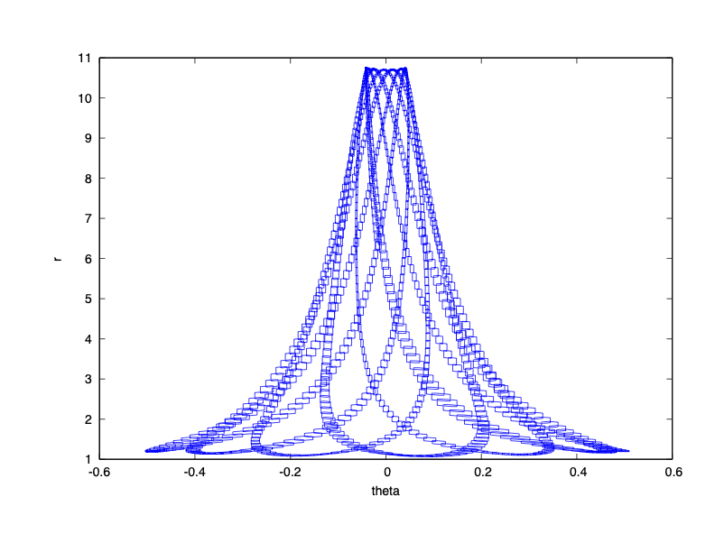

### System Dynamics

$\dot{r} = v_r$

$\dot{\theta} = \omega$

$\dot{v_r} = r \omega^2 + 9.8 \cos(\theta) - 2 (r - 1)$

$\dot{\omega} = (-2 v_r \omega - 9.8 \sin(\theta))/r$

### Reachability Problem

Initial state set: $r(0) \in [1.19,1.21]$, $\theta(0) \in [0.49,0.51]$, $v_r = 0$, $\omega = 0$

Time horizon: $[0,30]$

### Result

