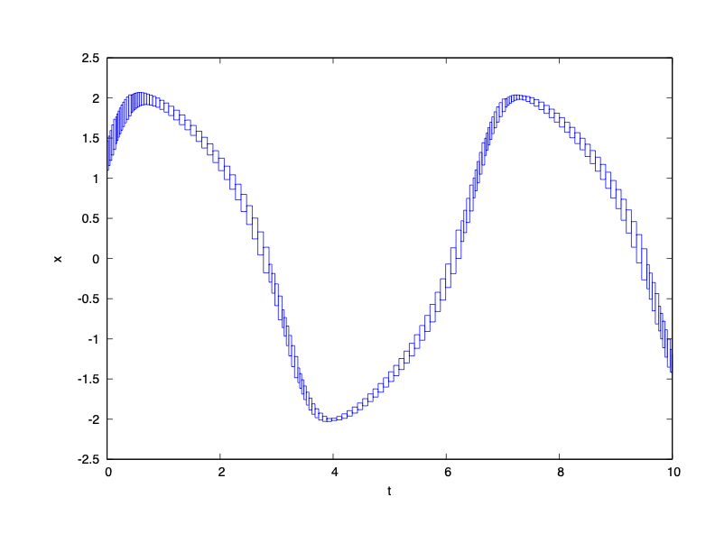
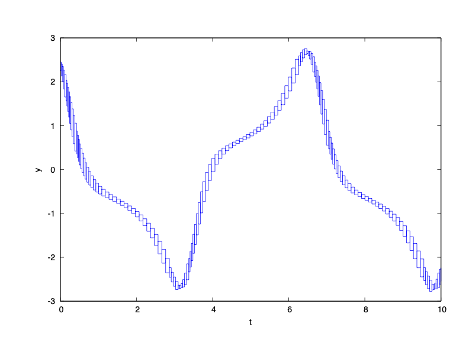

### System Dynamics

$\dot{x} = y$

$\dot{y} = (1 - x^2) y - x$

### Reachability Problem

Initial state set: $x(0) \in [1.1, 1.4]$, $y(0) \in [2.35, 2.45]$

Time horizon: $[0,10]$

Safe set: $y \leq 2.75$

### Result

